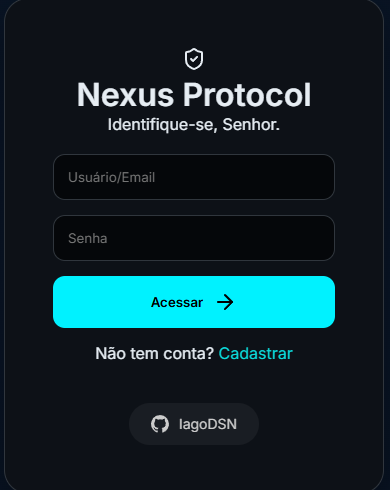

#  Nexus AI

<div align="center">
  


[](https://github.com/IagoDSN/Nexus_IA)
</div>

Assistente inteligente com interface de chat e comando de voz contínuo. O projeto utiliza uma stack moderna focada em performance local e baixíssima latência.

## 🚀 Funcionalidades

* **Chat com IA:** Interface textual fluida, moderna e responsiva.
* **Modo chat continuo:** Reconhecimento de voz em tempo real com overlay.
* **Memória por usuário:** Conversas armazenadas no banco de dados (MySQL)
* **Sistema de login:** JWT (Sessão por usuário) + autenticação segura
* **Controle Administrativo:** Dashboard exclusivo para gerenciamento de usuários, bans e logs.
* **Personalidade Dinâmica:** Escolha entre (Voz Brasileira/Atlas) ou (Voz Portuguesa/Luso).
* **TTS Local com Piper:** Geração de voz extremamente rápida processada localmente no servidor com Piper.
* **Inteligência Groq:** Processamento de linguagem natural de alta velocidade via API.

## 🖼️ Preview da Interface

<p align="center">
  
</p>

<br>

## 🛠 Tecnologias Utilizadas

**Backend:**


**Frontend:**


---

## ⚙️ Instalação

### 1. Clonar e Backend (Python)
```bash
# Clone o repositório
git clone https://github.com/IagoDSN/Nexus_IA
cd Nexus_IA

# Crie um ambiente virtual
python -m venv venv

# Ative o ambiente virtual
venv\Scripts\activate

# Instale as dependências
pip install -r requirements.txt
```

### 2. Frontend (Node.js & Vite)
O frontend é construído com TypeScript e Vite. Você precisa compilar os arquivos para o FastAPI servir a pasta dist.

```bash
# Navegue até a pasta do web app
cd nexus-web

# Instale as dependências do Node
npm install

# Gere o build de produção
npm run build

# Retorne para a raiz do projeto
cd ..
```
---

## 🗄️ Configuração do Banco de Dados

O projeto utiliza **MySQL/MariaDB**. Para configurar a estrutura necessária:

1. Certifique-se de ter um servidor MySQL rodando em sua máquina.
2. Localize o arquivo de script em: `BD/script.sql`.
3. Execute o script no seu gerenciador de banco de dados (HeidiSQL, MySQL Workbench, ou via terminal) para criar o banco `nexus` e as tabelas `users` e `memory`.

```bash
# Exemplo via terminal
mysql -u root -p < BD/script.sql
```

## 🔑 Configuração do ambiente
O projeto utiliza variáveis de ambiente para chaves de API e configurações sensíveis.

Atualize o arquivo **.env** na raiz do projeto com suas credenciais de banco de dados, a chave mestra de criptografia e o token de acesso à API do Groq.

```bash
DB_HOST=localhost
DB_PORT=3306
DB_USER=root
DB_PASSWORD=sua_senha
DB_NAME=nexus

SECRET_KEY=sua_chave_secreta

GROQ_API_KEY=sua_chave
```

## ▶️ Como Rodar
Com o ambiente configurado, inicie o servidor FastAPI:

```bash
uvicorn main:app --reload
```

Após iniciar, acesse a interface pelo navegador:
http://127.0.0.1:8000

## ⚠️ Importante

Piper TTS: Certifique-se de que os binários e modelos do Piper estão na pasta correta conforme configurado no main.py.

Build do Front: Sempre que fizer alterações nos arquivos .ts ou .css da pasta nexus-web, você deve rodar npm run build novamente para que as mudanças reflitam no servidor FastAPI.

Microfone: O navegador exige uma conexão segura (HTTPS ou localhost) para permitir o uso do microfone.

## Author

<div align="left">
  <code><strong>IagoDSN</strong></code> — <i>Full Stack Developer & AI Creator</i>
  <br>
  
</div>

<br>

<div align="left">
  <a href="https://github.com/IagoDSN" target="_blank">
    
  </a>
  <a href="https://www.linkedin.com/in/iago-nunes-2509a83ba" target="_blank">
    
  </a>
  <a href="https://www.instagram.com/iago_sepini/" target="_blank">
    
  </a>
</div>
